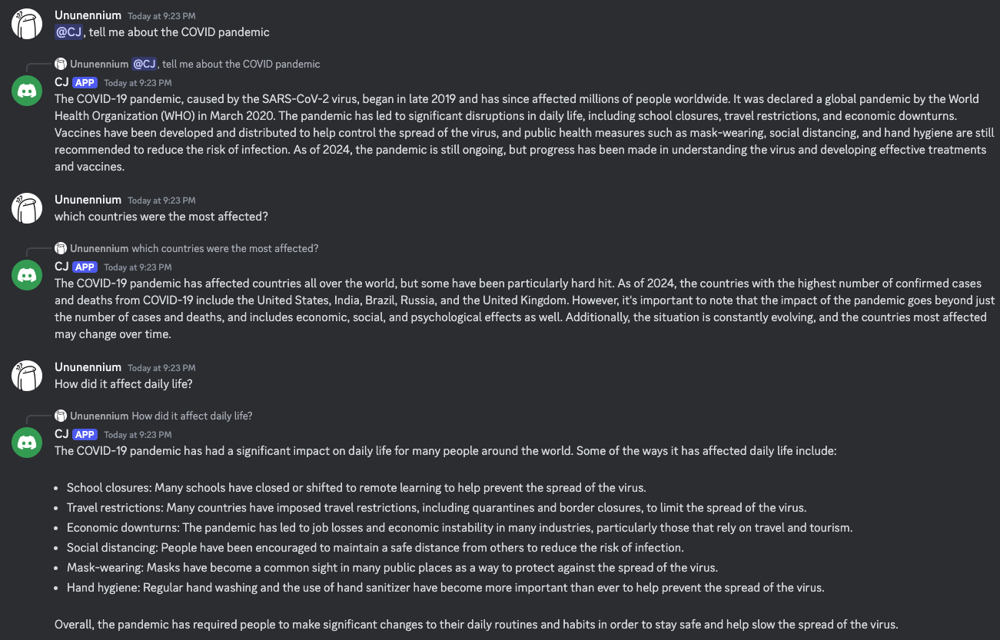
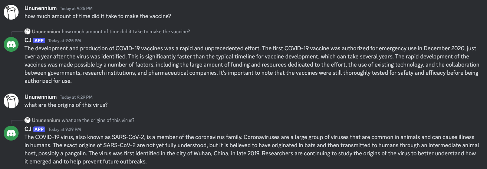
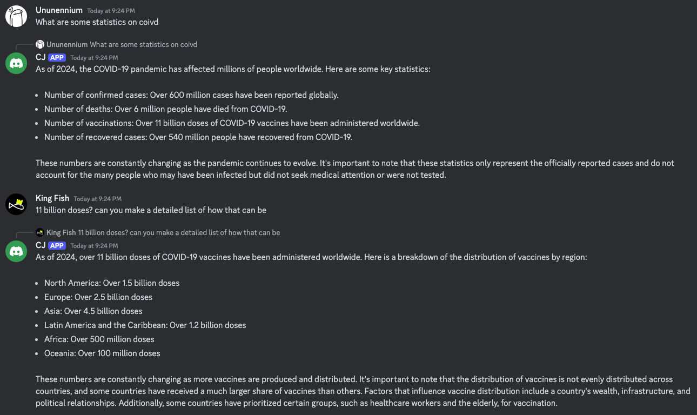
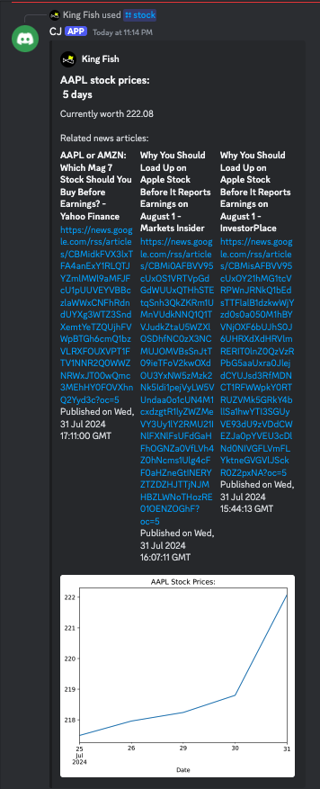
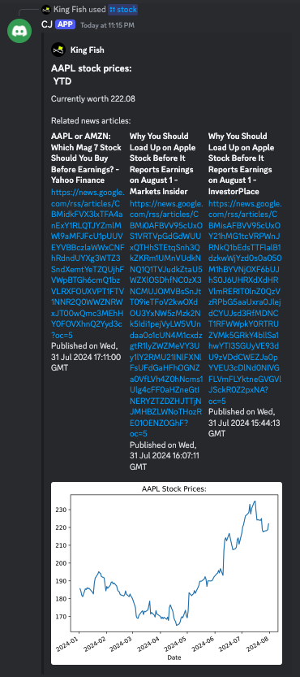
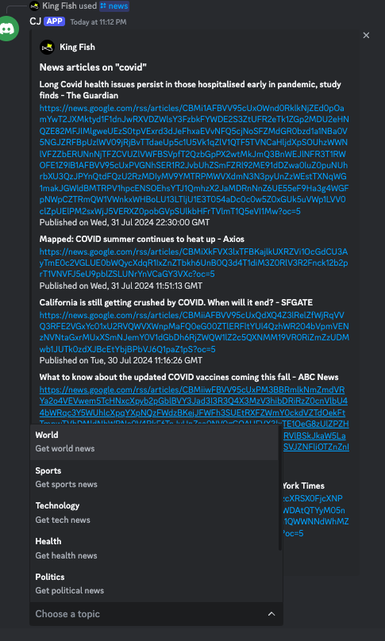
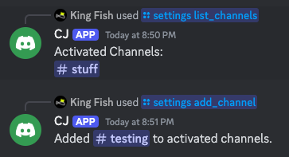

# Magnificent Magnetars

## Information Overload
As the theme of this codejam, we decided to make a discord bot that can provide information on a variety of topics. You can talk with a chatbot or ask for stock information and news articles and summaries. However, in order to overload you, the bot will give you a lot of information at once. You're given way more news articles than you need. More stock information than you need. And the chatbot is constantly talking. It's up to you to sift through the information and find what you need.

## Chatbot
Using [Mistralai's 7B Instruct model](https://huggingface.co/mistralai/Mistral-7B-Instruct-v0.3), this chatbot is able to provide information on a variety of topics. It can answer questions, provide summaries, and even have a conversation with you. It's a great way to get information on a topic you're interested in.
We told the chatbot that it should always be providing information in such a way that it overload's the user. It gives fun facts often as well.

## Stock Information
Using [Yahoo! Finance's API](https://pypi.org/project/yfinance/), this command displays the current value of a stock, a visual representation of the stock's historical price over a specified period of time and gives news articles related to the stock. It is useful for analysing the stock market and making good investment choices.

## News Articles & Summaries
The bot can provide news articles and summaries on a variety of topics. It will give you a lot of articles and summaries at once, so you'll have to sift through them to find what you need. It's a great way to get a lot of information on a topic quickly.

## Settings
Currently there is only one setting for the bot. Adding and removing channels that the chatbot can respond in. Although it goes against the theme of information overload, we wanted to make sure that the bot was still useful and not spamming every channel it could.

The settings are stored by guild in an SQL DB.

## Subscriptions

Subscription command changes the source that the news command pulls articles from. Goal was to make subscriptions change news source between Google News, Yahoo News, and Washington Post.
Due to limitations in the RSS service provided by Yahoo News and Washington Post, the news command will only pull articles by the subscribed to service when searching by category, otherwise
it defaults to Google News. Washington Post was also omitted from final build since that RSS service wasn't playing nice with the current news code.

## Participants
King Fish - Created the chatbot feature.

Ununennium - Created the news, summarize, and stock commands

Jerry - Created the subscription feature

ilcheese2 - Created the settings feature
